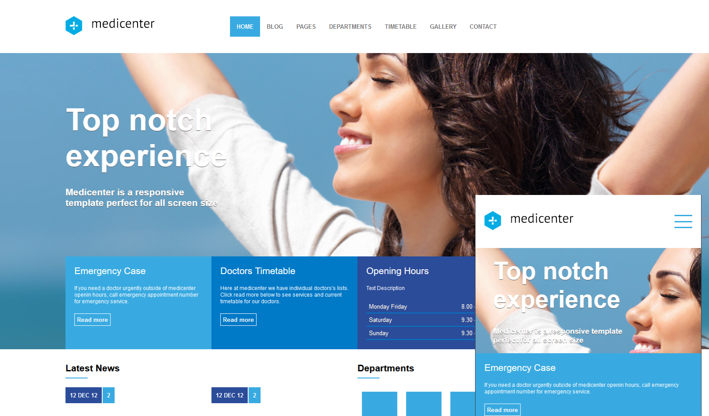

<h1 aling="center">
  Medical clinical project 💉 🩺
</h1>

<h1> <a href="https://rmarlon.github.io/Prototype-MediCenter/"> See the site</a></h1>

## ⚕️ About

**Medi Center** is a web page of a clinic, where it was designed to use on desktop, tablet and mobile 🏥



## 💊 Why, was the project done ? 

Initially the project was done in order to improve my skills as a developer, but as soon as I concluded I realized that where I live has enough clinics that do not have the ease of a tool that would improve and much in terms of service and time.

## Tools used 🛠️

- [HTML5](https://developer.mozilla.org/pt-BR/docs/Web/HTML/Element)
- [CSS3](https://developer.mozilla.org/pt-BR/docs/Web/CSS)
- [Java Script](https://developer.mozilla.org/pt-BR/docs/Web/JavaScript)

## How to contribute ?💭

```bash
# Clone the project
$ git clone https://github.com/RMarlon/Prototype-MediCenter
````

```bash
# Enter directory
$ cd Prototype-MediCenter
````

```bash
# Install the dependencies
$ npm install
````
<p aling="center"> Or </p>

```bash
# Install the dependencies
$ yarn
````
